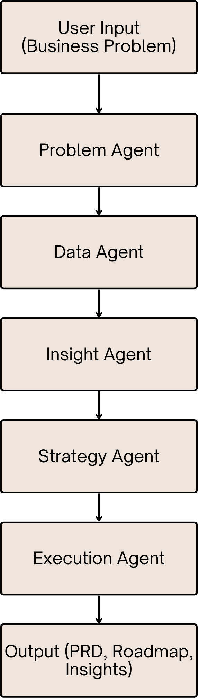

# ai-business-decision-engine
AI-powered agentic system that converts business problems into insights, strategy, and execution plans
# 🤖 AI Business Decision Engine (Agentic PM System)

## 📌 Problem
Business teams struggle to quickly analyze problems and convert them into actionable plans.

## 💡 Solution
An AI-powered agent system that mimics how Product Managers, Analysts, and Engineers collaborate.

## 🧠 How It Works

1. Problem Agent → Defines business problem  
2. Data Agent → Analyzes data  
3. Insight Agent → Identifies root causes  
4. Strategy Agent → Suggests actions  
5. Execution Agent → Generates PRD, roadmap, tasks  

## 🏗️ Architecture

## 📊 Demo Use Case
Revenue dropped by 15% — system analyzes and generates recommendations.

The app now includes richer sample datasets and deeper, stage-by-stage dropout diagnostics so users can clearly understand where losses happen and why.

## 📁 Outputs

- [Insights](outputs/insights.md)
- [Roadmap](outputs/roadmap.md)
- [PRD](outputs/prd.md)

## 🚀 Impact
- Faster decision-making
- Structured problem solving
- Reduced dependency on manual analysis

## 🧠 Learnings
- Prompt structuring is critical
- Agent-based workflows improve clarity
- Iteration improves output quality
